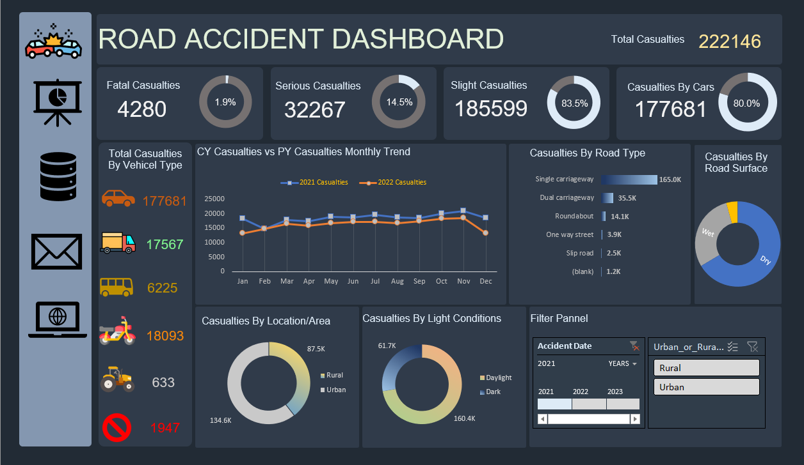

Here’s the README file tailored to your **Road Accident Dashboard** built using Excel:

---

# 🚗 Road Accident Dashboard (Excel)

## 🎥 Demo

Here’s a quick look at the **Road Accident Dashboard** built using **Microsoft Excel** 👇

---

## 📸 Dashboard Screenshots

Here are some screenshots of the **Road Accident Dashboard** in Excel:

### Overview of Dashboard

---

## Overview

This **Road Accident Dashboard** is an **interactive dashboard** created using **Microsoft Excel**. The dashboard provides insightful visualizations of road accident data, including:

* **Total casualties** and breakdown by severity (fatal, serious, slight)
* **Casualty distribution** by vehicle type (car, bus, bike, van, etc.)
* **Monthly trends** comparing casualties for the current year (CY) vs. previous year (PY)
* **Casualty data by road type** (single carriageway, dual carriageway, roundabout, etc.)
* **Casualties by location** (urban vs. rural)
* **Casualty breakdown by light conditions** (day vs. night)
* **Casualties based on road surface conditions** (wet, dry)

The dashboard is designed for **data analysts, road safety professionals, and researchers** looking to analyze and visualize road accident data for improved decision-making.

---

## 🗂 Dataset

* **Data Source:** The dataset contains road accident statistics from government sources or public datasets.
* **Fields Used:**

  * Casualties by vehicle type (car, bike, bus, etc.)
  * Road surface and weather conditions
  * Accident location (urban/rural)
  * Casualty severity (fatal, serious, slight)
  * Monthly casualty data for trend analysis

---

## ⚙️ Features

* **Interactive Dashboard:** Filters for year and accident location (urban/rural) to customize data view.
* **Casualties by Vehicle Type:** View breakdown by different vehicle types (car, bus, bike, etc.).
* **Monthly Casualty Trend:** Analyze monthly casualty trends for current and previous years.
* **Casualties by Road Type:** View data for various road types like single carriageway, dual carriageway, roundabouts, etc.
* **Casualties by Light Conditions:** Visualize accident data based on light conditions (daylight vs. dark).
* **Casualties by Road Surface:** Understand the impact of wet vs. dry road surfaces on accident severity.

---

## 👨‍💻 About the Developer

**Abu Usama** – Data Analyst | Excel Enthusiast | Road Safety Advocate
Passionate about transforming raw data into valuable insights to improve road safety.

🌍 Connect with me:

---

## 🔗 References

* Government road accident datasets
* Microsoft Excel resources for interactive dashboard creation
* Road safety and accident analysis research papers

---

## 📝 License

This project is licensed under the **MIT License** – see the [LICENSE](LICENSE) file for details.

---

